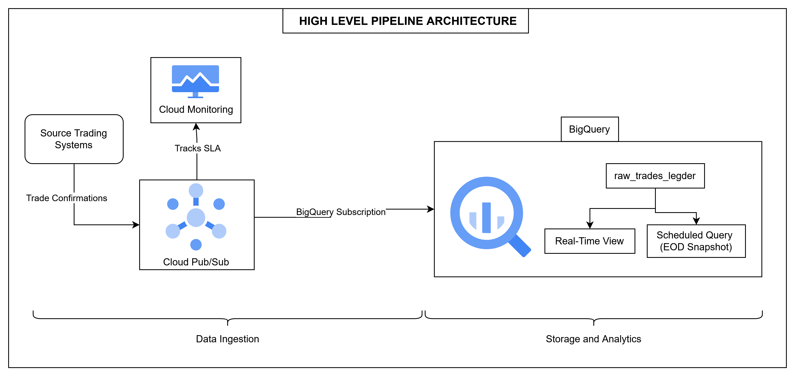

# Architectural Design: Trade Confirmation & Net Open Position (NOP) Pipeline

## System Overview

This document outlines a production-ready, serverless architecture for real-time Net Open Position (NOP) monitoring. To meet the SLA of <60 seconds, the system utilizes a "Streaming Ingest, On-Demand Compute" pattern. By leveraging Google Cloud Platform’s managed, event-driven services, we achieve sub-minute latency while maintaining a "scale-to-zero" cost model appropriate for a desk with 25–50 trades per day.

## High-Level Pipeline Architecture

The system operates through a simple three-stage flow: trades enter through a managed event queue (Pub/Sub), are stored immutably in BigQuery, and are aggregated through SQL views for both real-time monitoring and end-of-day reconciliation. This design decouples data ingestion from processing, ensuring that no trade events are lost or processed out of order.

## 1. Data Ingestion: Google Cloud Pub/Sub
To guarantee the 60-second delivery target, the system uses Google Cloud Pub/Sub as a high-speed ingestion layer.

Trade confirmations enter the system through Google Cloud Pub/Sub, a managed message queue service. Pub/Sub serves as a reliable buffer between trading systems and downstream processing, ensuring that every trade confirmation is received exactly once and processed in the correct order.

### Operational Mechanism

When a trade occurs, the originating system publishes a message to the Pub/Sub topic. Pub/Sub holds this message and forwards it to a BigQuery subscription, which automatically writes the trade record directly into a landing table (`e.g raw_trades_ledger`). Under normal conditions, this entire flow completes `within 10 seconds` from the moment the trade is confirmed.

### Ensuring Trade Order Consistency
Financial integrity depends on the sequence of events. To handle retroactive corrections accurately, Pub/Sub is configured with Ordering Keys using the `trade_id`. This ensures that if a Day 3 trade is amended or reversed on Day 7, the events are written to the ledger in the exact sequence they occurred, maintaining logical consistency in the audit trail.

### Configuration for Reliability

The BigQuery subscription is configured with two critical settings. First, the topic schema validation is enabled, which ensures that every incoming message conforms to the expected trade format before being accepted. Second, metadata writing is enabled, which automatically populates a `publish_time` column in BigQuery. This timestamp acts as the transaction time and serves as the ground truth for temporal ordering in audit trails and historical reconciliation.

To handle exceptional cases, a dead letter topic is configured to capture any messages that fail ingestion after the system's maximum retry threshold. These messages are routed to a monitoring queue for manual investigation and intervention by operations teams.

## 2. Storage and Processing: Google BigQuery

BigQuery serves as the system's data warehouse and processing engine. It accepts streaming inserts from Pub/Sub, achieving sub-minute latency while handling complex analytical queries in seconds. This serverless approach means no database administration, automated scaling, and pay-per-query pricing.

### The Immutable Trade Ledger

All trade events—whether original confirmations, amendments, or reversals—are appended to a single table `raw_trades_ledger`. This ledger is immutable: once a record is written, it is never deleted or modified. Each record includes the trade details and the event type from Pub/Sub. This creates an authoritative audit trail that can always be replayed to verify the system's computation at any point in time.

### Real-Time Position View

The system computes current positions through a SQL view that aggregates the `raw_trades_ledger` table by summing trade amounts grouped by currency. Because this view operates over all events in the ledger, it naturally handles retroactive corrections: when a Day 7 reversal is appended to cancel a Day 3 trade, the sum automatically reflects the corrected position without any special logic or manual override.

### End-of-Day Snapshot (The Golden Record)

To preserve historical positions and support regulatory reconciliation, a BigQuery Scheduled Query runs automatically each evening at a fixed time. This query captures the state of the real-time view at that moment and persists it to a historical table. This process creates the system's "Golden Record"—the official end-of-day position statement.

The key insight is that historical records remain unchanged even after retroactive corrections. If a Day 3 trade is reversed on Day 7, the Day 3 historical record is not altered (preserving the audit trail of what was reported at that time). However, the Day 7 historical record and the current real-time view both reflect the corrected NOP. This dual approach balances audit requirements with data accuracy: external stakeholders see what was genuinely known on each day, while internal systems always operate with the most current understanding.

## 3. Operational Monitoring: Google Cloud Monitoring

The system's SLA targets sub-minute delivery of trade data from source systems to the data warehouse. To track performance against this SLA, Google Cloud Monitoring is configured to watch the `subscription/oldest_unacked_message_age` metric. This metric measures how long the oldest unprocessed message has been sitting in the Pub/Sub queue before being delivered to BigQuery. When this metric exceeds expected thresholds, alerts are triggered to notify operations teams that trade data is accumulating in the queue without being processed.

## 4. Addressing Business Requirements

### Handling Retroactive Amendments (Q20)

One of the most complex scenarios in financial systems is handling trades that are corrected after the fact. For example, a trade executed and confirmed on Day 3 may need to be reversed or amended on Day 7 due to a client complaint, system correction, or reconciliation finding.

The system handles this elegantly through its event-based design. When a reversal is needed, a new record is appended to the `raw_trades_ledger` on Day 7 with a negative amount, effectively canceling the original Day 3 trade. The real-time view immediately reflects this correction by recalculating the sum over all events. The audit trail remains intact: both the Day 3 original trade and the Day 7 reversal remain visible for investigation and compliance purposes.

Historically stored data also reflects this duality. The Day 3 end-of-day snapshot remains unchanged, showing what was genuinely known on that date. However, the Day 7 end-of-day snapshot and all subsequent queries reflect the corrected position. This approach satisfies both audit requirements and operational accuracy.

### Batch and Stream Reconciliation (Q21)

In most financial systems, batch and real-time pipelines diverge over time, requiring complex reconciliation logic to identify differences. This system simplifies reconciliation dramatically: both the real-time view and the batch end-of-day snapshot read from the exact same `raw_trades_ledger` table.

A scheduled BigQuery reconciliation query can verify reconciliation by checking whether any messages arrived in Pub/Sub after the EOD snapshot was taken. If no trades occurred after EOD, the real-time view and the batch snapshot will be identical. If trades did occur after EOD, the difference is precisely quantifiable as the trades that arrived after the snapshot cutoff time. This design eliminates the risk of two separate pipelines diverging due to processing differences, data quality issues, or logic bugs.

### Cost Model (Q22)

At the system's current operating scale of 25–50 trades per day, implementing a true streaming architecture introduces significant complexity without proportional benefit. A more practical approach for this volume is to use Cloud Run with Cloud Scheduler to trigger a processing job every 5 minutes. Each job typically completes in approximately 30 seconds, consuming resources only during execution.

This micro-batch approach provides effective cost control. Running 288 jobs per day (every 5 minutes × 24 hours), each consuming minimal resources, costs approximately $3–8 per month. This is dramatically lower than the alternative of maintaining always-on infrastructure or implementing sophisticated streaming frameworks.

**Conditions for Architecture Evolution**

This design is appropriate for the current environment but should be revisited if business requirements change, the architecture can be upgraded to full streaming if:

- Trading volume exceeds 500 trades per day, making micro-batching inefficient
- Regulatory requirements mandate real-time reporting with sub-minute latency
- Automated hedging systems or algorithms require position data updates faster than every 5 minutes

At that point, the Pub/Sub and Dataflow infrastructure becomes a justified investment to handle higher volumes and stricter latency requirements.
